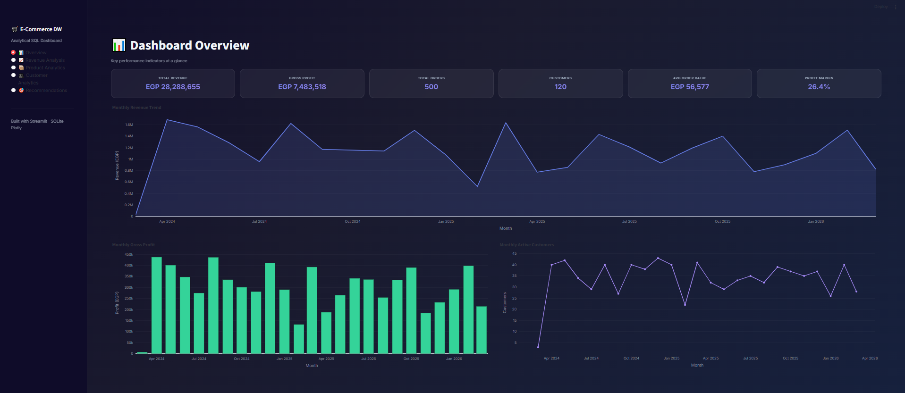
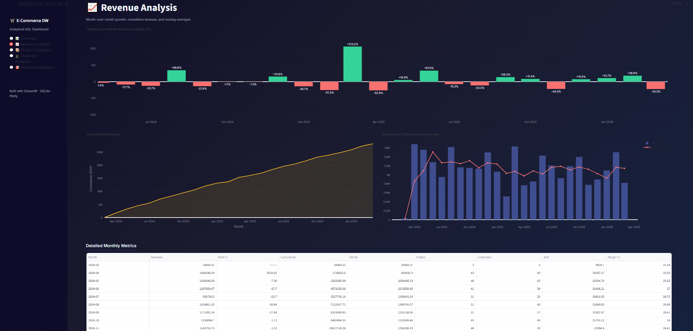
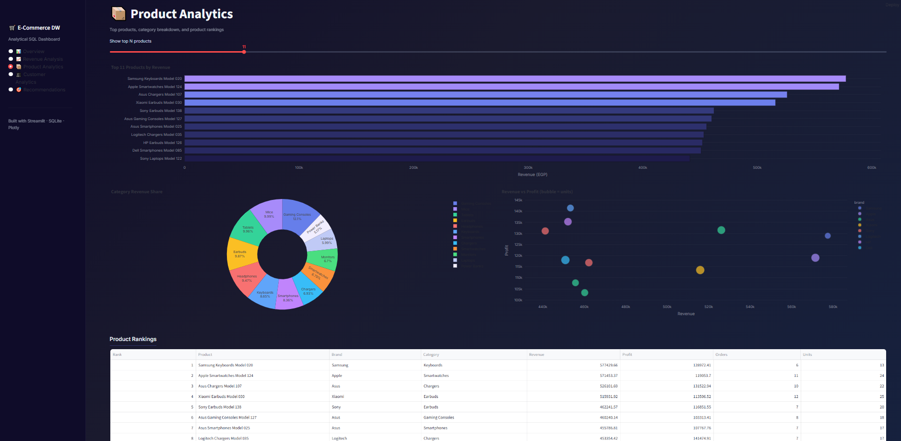
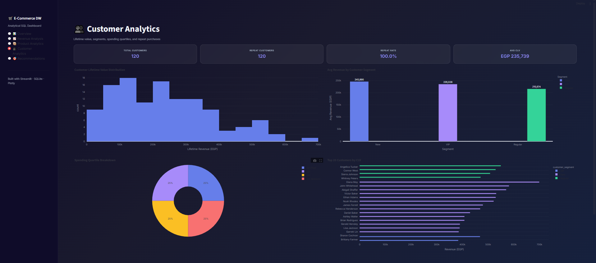
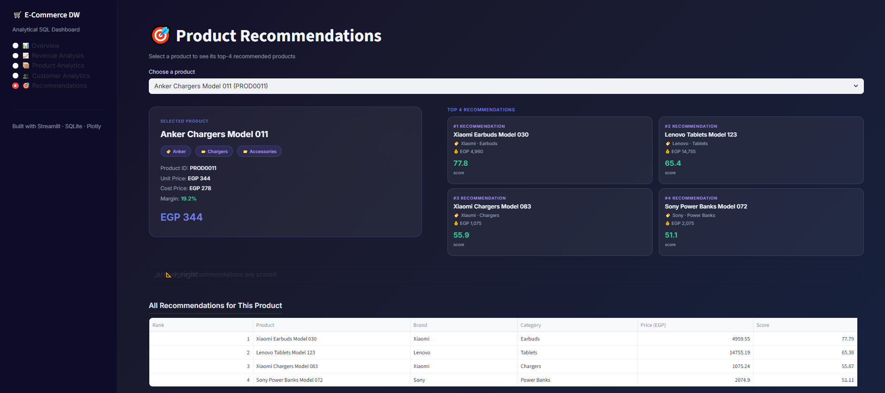

# E-Commerce Analytical SQL with Product Recommendation

A data warehouse and analytics project featuring a **Star Schema** design, **21 analytical SQL calculations** (window functions, rankings, CLV, etc.), and a **multi-factor product recommendation system** — all served through an interactive **Streamlit dashboard**.

## Quick Start

```bash
pip install -r requirements.txt
streamlit run app.py
```

The app creates an in-memory SQLite database on startup — **no MySQL server needed**.

---

## Dashboard Screenshots

### 📊 Overview
KPI cards (Revenue, Profit, AOV, Orders, Customers, Margin) + monthly trend charts.



### 📈 Revenue Analysis
MoM growth, cumulative revenue, 3-month moving average.



### 📦 Product Analytics
Top products by revenue, category share donut, revenue vs profit scatter.



### 👥 Customer Analytics
CLV distribution, spending quartiles, segment comparison, repeat purchase rate.



### 🎯 Recommendations
Select a product (left) → see top-4 recommendations with composite scores (right).



---

## Project Structure

```
├── sql/                              # Original MySQL DDL & seed scripts
│   ├── 01_create_dw_schema.sql       # Star schema (6 dims + 1 fact)
│   ├── 02_seed_dimensions.sql        # Dimension seed data
│   ├── 03_seed_fact_order_lines.sql  # 1,000 order lines
│   ├── 04_validation_checks.sql      # Data quality checks
│   ├── 05_kpi_views.sql              # Monthly KPIs, CLV, repeat rate views
│   └── 06_recommendation_top4.sql    # Top-4 recommendation view
├── db.py                             # SQLite data layer (mirrors MySQL schema)
├── app.py                            # Streamlit dashboard (5 pages)
├── requirements.txt                  # Python dependencies
├── screenshots/                      # Dashboard screenshots
├── BUSINESS_CALCULATIONS.md          # 21 calculations mapped to code
└── README.md
```

## Data Warehouse Schema

**Star Schema** with 1 fact table and 6 dimensions:

| Table | Rows | Description |
|-------|------|-------------|
| `fact_order_line` | 1,000 | One product per order (grain) |
| `dim_date` | 730 | 2 years of dates |
| `dim_customer` | 120 | Customer demographics |
| `dim_product` | 140 | Products with pricing |
| `dim_category` | 12 | Category hierarchy |
| `dim_payment` | 8 | Payment methods |
| `dim_shipping` | 8 | Shipping options |

## Recommendation Scoring

Composite score (0–100) using 6 weighted factors:

| Factor | Weight | Description |
|--------|--------|-------------|
| Co-purchase frequency | 40% | Normalized per source product |
| Recency | 25% | Exponential decay (90-day half-life) |
| Category match | 10% | Same subcategory or parent category |
| Popularity | 10% | Order count of candidate |
| Profit margin | 10% | Higher-margin preference |
| Availability | 5% | Only active products |

## Tech Stack

- **Backend**: Python, SQLite (in-memory)
- **Frontend**: Streamlit, Plotly
- **Data**: Faker (deterministic synthetic data)
- **Original SQL**: MySQL 8.0 compatible
